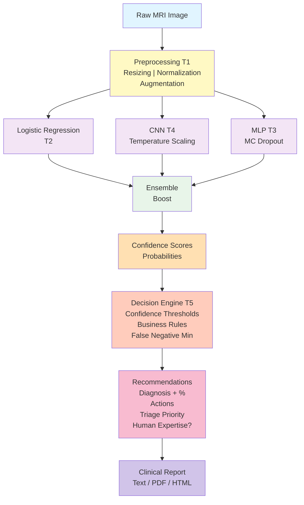

# Brain Tumor Decision Support System (DSS) - Diagnosis Support

**Machine Learning Project (ALIF83)** - EFREI 2025–2026  
Course Instructor: Mohamed HAMIDI

## GitHub Repository

**Project Repository**: [https://github.com/Teravla/Projet_ML](https://github.com/Teravla/Projet_ML)

## Authors

**Valentin MENON** - <valentin.menon@efrei.net>

---

## Table of Contents

- [Brain Tumor Decision Support System (DSS) - Diagnosis Support](#brain-tumor-decision-support-system-dss---diagnosis-support)
  - [GitHub Repository](#github-repository)
  - [Authors](#authors)
  - [Table of Contents](#table-of-contents)
  - [Project Objective](#project-objective)
    - [Medical Context](#medical-context)
    - [Dataset and Clinical Classes](#dataset-and-clinical-classes)
    - [Decision Logic with Confidence Thresholds](#decision-logic-with-confidence-thresholds)
  - [Installation](#installation)
    - [Without Poetry (pip)](#without-poetry-pip)
    - [With Poetry](#with-poetry)
  - [Dataset Setup](#dataset-setup)
    - [Download the Dataset](#download-the-dataset)
    - [Organize the Data](#organize-the-data)
  - [Running Components](#running-components)
    - [The 7 Training Tasks](#the-7-training-tasks)
      - [**Task 1: Exploration \& Preprocessing**](#task-1-exploration--preprocessing)
      - [**Task 2: Logistic Regression + Calibration**](#task-2-logistic-regression--calibration)
      - [**Task 3: MLP with Uncertainty (MC Dropout)**](#task-3-mlp-with-uncertainty-mc-dropout)
      - [**Task 4: Optimized CNN + Temperature Scaling**](#task-4-optimized-cnn--temperature-scaling)
      - [**Task 5: Clinical Decision Engine**](#task-5-clinical-decision-engine)
      - [**Task 6: Dashboard \& Reports**](#task-6-dashboard--reports)
      - [**Task 7: Performance Analysis**](#task-7-performance-analysis)
      - [**Accuracy Improvement**](#accuracy-improvement)
    - [Web Dashboard](#web-dashboard)
    - [Documentation](#documentation)
    - [Code Quality Verification](#code-quality-verification)
      - [Formatting (Black)](#formatting-black)
      - [Static Analysis (Pylint)](#static-analysis-pylint)
      - [All at once (Black + Pylint)](#all-at-once-black--pylint)
      - [Complexity Metrics (Radon)](#complexity-metrics-radon)
  - [Web Interface Usage](#web-interface-usage)
    - [Starting the Dashboard](#starting-the-dashboard)
    - [Main Sections](#main-sections)
      - [1. **Home**](#1-home)
      - [2. **Real-Time Prediction**](#2-real-time-prediction)
      - [3. **Statistics \& Performance**](#3-statistics--performance)
      - [4. **Detailed Reports**](#4-detailed-reports)
      - [5. **Case Management**](#5-case-management)
  - [System Architecture](#system-architecture)
  - [Task Descriptions](#task-descriptions)
    - [T1: Exploration \& Preprocessing](#t1-exploration--preprocessing)
    - [T2: Logistic Regression + Calibration](#t2-logistic-regression--calibration)
    - [T3: MLP with Uncertainty (MC Dropout)](#t3-mlp-with-uncertainty-mc-dropout)
    - [T4: Optimized CNN + Temperature Scaling](#t4-optimized-cnn--temperature-scaling)
    - [T5: Clinical Decision Engine](#t5-clinical-decision-engine)
    - [T6: Dashboard \& Reports](#t6-dashboard--reports)
    - [T7: Performance Analysis](#t7-performance-analysis)
  - [Project Structure](#project-structure)
  - [Quick Commands Reference](#quick-commands-reference)
  - [Jupyter Notebooks](#jupyter-notebooks)
  - [Core Concepts](#core-concepts)
    - [Confidence vs Accuracy](#confidence-vs-accuracy)
    - [Calibration](#calibration)
    - [False Negatives = Medical Danger](#false-negatives--medical-danger)
    - [MC Dropout = Uncertainty](#mc-dropout--uncertainty)
  - [Troubleshooting](#troubleshooting)
    - [Error: "ModuleNotFoundError: No module named 'tensorflow'"](#error-modulenotfounderror-no-module-named-tensorflow)
    - [Error: "CUDA not found"](#error-cuda-not-found)
    - [Dashboard won't start?](#dashboard-wont-start)
    - [Notebooks won't open?](#notebooks-wont-open)
  - [Support \& Documentation](#support--documentation)
  - [Critical Reflection: Why CNN Outperforms Other Techniques](#critical-reflection-why-cnn-outperforms-other-techniques)
    - [Performance Comparison](#performance-comparison)
    - [Why CNNs Excel at Medical Image Analysis](#why-cnns-excel-at-medical-image-analysis)
      - [1. **Spatial Feature Preservation**](#1-spatial-feature-preservation)
      - [2. **Hierarchical Feature Learning**](#2-hierarchical-feature-learning)
      - [3. **Translation Invariance**](#3-translation-invariance)
      - [4. **Parameter Efficiency**](#4-parameter-efficiency)
    - [Limitations Addressed](#limitations-addressed)
    - [Temperature Scaling Enhancement](#temperature-scaling-enhancement)
    - [Conclusion](#conclusion)
  - [Ethics \& Responsibility](#ethics--responsibility)

---

## Project Objective

### Medical Context

This project implements a **Decision Support System (DSS)** for a radiology department specialized in brain tumor diagnosis via MRI.

**Unlike a simple classifier**, the DSS does not merely provide a label. It acts as a **medical partner** by:

- Assessing the **confidence level** of each prediction
- Recommending **appropriate actions** according to the degree of certainty
- Prioritizing **urgent cases** requiring immediate human expertise
- **Minimizing false negatives** (critical vital risk)

### Dataset and Clinical Classes

**Dataset**: Brain Tumor MRI Dataset (Kaggle)

| Class               | Type            | Urgency | Action                      |
| ------------------- | --------------- | ------- | --------------------------- |
| **Glioma**          | Malignant tumor | URGENT  | Immediate oncology referral |
| **Meningioma**      | Benign tumor    | Normal  | 48-hour surveillance        |
| **Pituitary Tumor** | Endocrinology   | Normal  | Specialized treatment       |
| **No Tumor**        | Healthy         | OK      | Patient reassurance         |

### Decision Logic with Confidence Thresholds

```txt
┌──────────────────────────────────────────┐
│    Prediction Confidence Level (%)       │
├──────────────────────────────────────────┤
│ >= 85%: Automatic diagnosis validated    │
│         -> Report sent to physician      │
│                                          │
│ 65-84%: Probable diagnosis               │
│         -> Review by junior radiologist  │
│                                          │
│ 50-64%: Uncertain case                   │
│         -> Review by senior radiologist  │
│                                          │
│ < 50%:  Very high uncertainty            │
│         -> Mandatory double reading      │
└──────────────────────────────────────────┘
```

---

## Installation

### Without Poetry (pip)

If you only have **Python 3.12+** installed:

```bash
# 1. Create a virtual environment
python -m venv venv

# 2. Activate the environment
# On Windows:
venv\Scripts\activate
# On macOS/Linux:
source venv/bin/activate

# 3. Install dependencies
pip install -r requirements.txt

# 4. Install development dependencies (optional)
pip install pylint==3.3.7 black==25.1.0 radon==6.0.1 taskipy==1.14.1 ipykernel mkdocs mkdocs-material mkdocstrings mkdocs-awesome-pages-plugin mkdocs-gen-files mkdocs-literate-nav mkdocstrings-python
```

### With Poetry

If you have Poetry installed:

```bash
poetry install
```

---

## Dataset Setup

Before running any training tasks, you need to prepare the Brain Tumor MRI dataset.

### Download the Dataset

Download the **Brain Tumor MRI Dataset** from [Kaggle](https://www.kaggle.com/datasets/masoudnickparvar/brain-tumor-mri-dataset) or your preferred source.

### Organize the Data

Place the dataset in the `data/` directory with the following structure:

```txt
data/
├── Testing/
│   ├── glioma/
│   ├── meningioma/
│   ├── notumor/
│   └── pituitary/
└── Training/
    ├── glioma/
    ├── meningioma/
    ├── notumor/
    └── pituitary/
```

**Important**:

- Each subdirectory should contain the corresponding MRI images (`.jpg`, `.png`, etc.)
- The folder names must match exactly as shown above (case-sensitive)
- Both `Training/` and `Testing/` folders are required for the system to work properly

Once the data is organized, you can proceed with running the training tasks.

---

## Running Components

### The 7 Training Tasks

The models and decision system are built through **7 sequential tasks**:

#### **Task 1: Exploration & Preprocessing**

```bash
# With pip
python src/cli/t1_preprocess.py

# With Poetry
poetry run task t1
```

Loads and preprocesses MRI images (resizing, augmentation).

#### **Task 2: Logistic Regression + Calibration**

```bash
python src/cli/t2_logistic_regression.py
# or: poetry run task t2
```

Trains a multinomial logistic regression model with Platt/Isotonic calibration for reliable probabilities.

#### **Task 3: MLP with Uncertainty (MC Dropout)**

```bash
python src/cli/t3_mlp_uncertainty.py
# or: poetry run task t3
```

Trains a neural network with MC Dropout to estimate uncertainty.

#### **Task 4: Optimized CNN + Temperature Scaling**

```bash
python src/cli/t4_cnn_temperature.py
# or: poetry run task t4
```

Trains a CNN with Temperature Scaling calibration.

#### **Task 5: Clinical Decision Engine**

```bash
python src/cli/t5_decision_engine.py
# or: poetry run task t5
```

Builds the decision system with confidence thresholds and generates clinical reports.

#### **Task 6: Dashboard & Reports**

```bash
# Not applicable directly; see Web Dashboard
```

#### **Task 7: Performance Analysis**

```bash
python src/cli/analyze_accuracy.py
# or: poetry run task analyze
```

Calculates business metrics: coverage rate, accuracy by confidence band, cost-benefit analysis.

#### **Accuracy Improvement**

```bash
# Full version with ensemble learning
python src/cli/accuracy_boost.py
# or: poetry run task boost

# Simplified version
python src/cli/accuracy_boost_simple.py
# or: poetry run task base64
```

---

### Web Dashboard

Launch the interactive web interface:

```bash
python src/cli/dashboard.py
# or: poetry run task dashboard
```

**URL**: <http://localhost:5000>

See [Web Interface Usage](#web-interface-usage) for more details.

---

### Documentation

Generate and serve documentation (mkdocs):

```bash
# With pip
cd docs && mkdocs serve --dev-addr=localhost:8974

# With Poetry
poetry run task docs
```

Access at: <http://localhost:8974>

---

### Code Quality Verification

#### Formatting (Black)

```bash
python -m black --config pyproject.toml src
# or: poetry run task black
```

#### Static Analysis (Pylint)

```bash
python -m pylint --rcfile config/.pylintrc --enable-all-extensions src
# or: poetry run task pylint
```

#### All at once (Black + Pylint)

```bash
# With pip: run the two commands above sequentially
# With Poetry:
poetry run task lint
```

#### Complexity Metrics (Radon)

```bash
python -m radon cc src -na -s
python -m radon mi src
# or: poetry run task radon
```

---

## Web Interface Usage

### Starting the Dashboard

```bash
python src/cli/dashboard.py
```

Open your browser at **<http://localhost:5000>**

### Main Sections

#### 1. **Home**

- Welcome and DSS explanation
- Links to all sections

#### 2. **Real-Time Prediction**

- Upload an MRI image
- Receive instantly:
  - Main diagnosis with predicted class
  - Confidence level (%)
  - Detailed scores for each class
  - Clinical recommendations
  - Action priority

#### 3. **Statistics & Performance**

- Confidence level distribution
- Confusion matrix
- Accuracy per class
- Automatic coverage rate
- Cost-benefit analysis

#### 4. **Detailed Reports**

- Generate text-format reports
- Complete information for each case
- PDF export (optional)

#### 5. **Case Management**

- Histogram of previous decisions
- Filter by confidence level
- Audit of uncertain cases (< 65% confidence)

---

## System Architecture



---

## Task Descriptions

### T1: Exploration & Preprocessing

- Loads Brain Tumor MRI dataset
- Resizes images to 224x224
- Normalizes pixels to [0, 1]
- Applies data augmentation (rotation, zoom, flip)
- Saves preprocessed datasets

### T2: Logistic Regression + Calibration

- Trains multinomial logistic regression model
- Applies Platt Scaling or Isotonic Regression calibration
- Measures probability reliability (Expected Calibration Error)
- Identifies uncertain predictions (prob < 0.7)

### T3: MLP with Uncertainty (MC Dropout)

- MLP network with MC Dropout in hidden layers
- Performs 20 forward passes to estimate uncertainty
- Calculates prediction standard deviation
- Detects model limitations

### T4: Optimized CNN + Temperature Scaling

- CNN architectures (baseline + optimized)
- Temperature Scaling at output for final calibration
- Saves activations for future analysis
- Early stopping and monitoring callbacks

### T5: Clinical Decision Engine

- **Confidence Thresholds**:
  - > = 85%: Automatic diagnosis
  - 65-84%: Review by junior
  - 50-64%: Review by senior
  - < 50%: Double reading + additional MRI
- **False Negative Management**: Asymmetric thresholds for "No Tumor"
- Generates recommendations and priorities

### T6: Dashboard & Reports

- Flask web interface for visualization
- JSON API for real-time predictions
- Structured report generation
- Global and per-case statistics

### T7: Performance Analysis

- Automatic coverage rate
- Accuracy by confidence band
- Cost-benefit analysis:

  ```txt
  Total_Cost = (FN x 1000) + (FP x 100) + (Review x 50)
  ```

- Confusion matrix by confidence level

---

## Project Structure

```txt
.
├── README.md                          # This file
├── requirements.txt                   # Pip dependencies
├── pyproject.toml                     # Poetry config + Tasks
│
├── src/                               # Source code
│   ├── cli/                           # CLI scripts (Tasks T1-T7)
│   │   ├── t1_preprocess.py
│   │   ├── t2_logistic_regression.py
│   │   ├── t3_mlp_uncertainty.py
│   │   ├── t4_cnn_temperature.py
│   │   ├── t5_decision_engine.py
│   │   ├── accuracy_boost.py
│   │   ├── analyze_accuracy.py
│   │   └── dashboard.py               # Web interface
│   │
│   ├── data/                          # Loading & preprocessing
│   │   ├── loader.py
│   │   ├── preprocess.py
│   │   ├── pipeline.py                # Consolidated utilities
│   │   └── augment.py
│   │
│   ├── models/                        # ML models
│   │   ├── cnn.py
│   │   ├── mlp.py
│   │   ├── log_reg.py
│   │   ├── calibration.py
│   │   ├── uncertainty.py
│   │   └── utils.py                   # Consolidated utilities
│   │
│   ├── decision/                      # Decision engine
│   │   ├── engine.py
│   │   ├── rules.py
│   │   └── triage.py
│   │
│   ├── evaluation/                    # Metrics & costs
│   │   ├── metrics.py
│   │   ├── costs.py
│   │   └── analysis.py
│   │
│   ├── reporting/                     # Report generation
│   │   ├── report_generator.py
│   │   └── templates.py
│   │
│   └── config/                        # Configuration
│       ├── settings.py
│       └── thresholds.py
│
├── notebooks/                         # Jupyter notebooks
│   ├── 01_exploration_pretraitement.ipynb
│   ├── 02_reglog_calibration.ipynb
│   ├── 03_mlp_incertitude.ipynb
│   ├── 04_cnn_temperature_scaling.ipynb
│   ├── 05_moteur_decision_clinique.ipynb
│   ├── 06_tableau_bord_rapports.ipynb
│   └── 07_analyse_performance_sad.ipynb
│
├── data/                              # Datasets (git-ignored)
│   ├── Training/
│   │   ├── glioma/
│   │   ├── meningioma/
│   │   ├── notumor/
│   │   └── pituitary/
│   └── Testing/
│       ├── glioma/
│       ├── meningioma/
│       ├── notumor/
│       └── pituitary/
│
├── artifacts/                         # Trained models
│   └── models/
│       ├── cnn_simple.keras
│       └── best_cnn_checkpoint.keras
│
├── web/                               # Web interface (HTML/CSS/JS)
│   ├── dashboard.html
│   ├── styles.css
│   └── script.js
│
├── docs/                              # mkdocs documentation
│   └── mkdocs.yml
│
└── config/                            # Configurations
    └── .pylintrc
```

---

## Quick Commands Reference

| Command                                          | Action              | With Poetry                 |
| ------------------------------------------------ | ------------------- | --------------------------- |
| `python src/cli/t1_preprocess.py`                | Preprocess images   | `poetry run task t1`        |
| `python src/cli/t2_logistic_regression.py`       | Logistic regression | `poetry run task t2`        |
| `python src/cli/t3_mlp_uncertainty.py`           | MLP + uncertainty   | `poetry run task t3`        |
| `python src/cli/t4_cnn_temperature.py`           | CNN + calibration   | `poetry run task t4`        |
| `python src/cli/t5_decision_engine.py`           | Decision engine     | `poetry run task t5`        |
| `python src/cli/accuracy_boost.py`               | Improve accuracy    | `poetry run task boost`     |
| `python src/cli/analyze_accuracy.py`             | Analyze performance | `poetry run task analyze`   |
| `python src/cli/dashboard.py`                    | Web dashboard       | `poetry run task dashboard` |
| `python -m black --config pyproject.toml src`    | Format code         | `poetry run task black`     |
| `python -m pylint --rcfile config/.pylintrc src` | Analyze code        | `poetry run task pylint`    |

---

## Jupyter Notebooks

Launch Jupyter to explore analyses:

```bash
# With pip
python -m jupyter notebook

# With Poetry
poetry run jupyter notebook
```

The 7 notebooks in `notebooks/` correspond to the project tasks.

---

## Core Concepts

### Confidence vs Accuracy

- **Accuracy**: Percentage of correct predictions globally.
- **Confidence**: Probability (softmax) assigned to the predicted class by the model.
- **DSS Goal**: Use confidence for intelligent routing (automatic vs human review).

### Calibration

- Neural network models are not always well-calibrated.
- Temperature Scaling and Platt calibration adjust probabilities to reflect actual accuracy.

### False Negatives = Medical Danger

- Predicting "No Tumor" when a tumor exists = CRITICAL CASE
- Requires very high threshold (>95%) before automatic conclusion.

### MC Dropout = Uncertainty

- Activates dropout during inference (20 passes)
- Each pass produces a slightly different prediction
- Standard deviation measures model uncertainty

---

## Troubleshooting

### Error: "ModuleNotFoundError: No module named 'tensorflow'"

-> Verify that you activated the virtual environment and installed dependencies.

### Error: "CUDA not found"

-> TensorFlow will run on CPU (slower). For GPU support, install `tensorflow[and-cuda]`.

### Dashboard won't start?

-> Check that port 5000 is not in use. Otherwise run: `python src/cli/dashboard.py --port 5001`

### Notebooks won't open?

-> Run `python -m ipykernel install --user` to register the Python kernel.

---

## Support & Documentation

- **Full Documentation**: Run `mkdocs serve` to view detailed docs.
- **Source Code**: Consult files in `src/` with detailed comments.
- **Project Specification**: See the project requirements provided by the course (Mohamed HAMIDI).

---

## Critical Reflection: Why CNN Outperforms Other Techniques

### Performance Comparison

Our experiments consistently demonstrate that **Convolutional Neural Networks (CNN)** significantly outperform traditional machine learning approaches for brain tumor MRI classification:

| Model               | Accuracy | Key Limitation                            |
| ------------------- | -------- | ----------------------------------------- |
| **CNN (Optimized)** | **~95%** | Requires more computational resources     |
| Logistic Regression | ~75%     | Cannot capture spatial features           |
| MLP                 | ~80%     | Loses spatial structure (flattened input) |

### Why CNNs Excel at Medical Image Analysis

#### 1. **Spatial Feature Preservation**

Unlike traditional ML methods that flatten images into 1D vectors, CNNs preserve the 2D spatial structure through convolutional layers. This is crucial for medical imaging where:

- Tumor location matters
- Tissue boundaries are diagnostic
- Spatial patterns indicate pathology

#### 2. **Hierarchical Feature Learning**

CNNs automatically learn features at multiple scales:

- **Early layers**: Detect edges, textures, and basic patterns
- **Middle layers**: Identify tissue types and tumor margins
- **Deep layers**: Recognize complex tumor morphology

Logistic regression and MLPs require manual feature engineering and cannot discover these hierarchical representations.

#### 3. **Translation Invariance**

Convolutional layers with pooling provide translation invariance, meaning the network can detect tumors regardless of their position in the image—a critical capability for medical diagnosis.

#### 4. **Parameter Efficiency**

Despite having millions of parameters, CNNs use weight sharing across spatial locations, making them more efficient than fully-connected networks for image data.

### Limitations Addressed

While CNNs require:

- More training time
- GPU acceleration
- Larger datasets

These trade-offs are justified by the **20% accuracy improvement** over traditional methods, which directly translates to:

- Fewer misdiagnoses
- Better patient outcomes
- Reduced need for invasive follow-up procedures

### Temperature Scaling Enhancement

Our implementation further improves CNN reliability through **temperature scaling calibration**, ensuring that confidence scores accurately reflect true prediction probabilities—essential for clinical decision-making.

### Conclusion

For medical image classification, CNNs are not just incrementally better—they represent a **fundamental paradigm shift** in how machines process visual medical data. Their ability to learn hierarchical spatial features makes them the gold standard for diagnostic AI systems.

---

## Ethics & Responsibility

**This system is an educational tool and demonstration.**

**Disclaimer**:

- Does NOT replace physician judgment.
- False positives/negatives are possible.
- Always requires human validation for critical cases.
- Complies with project requirements (false negative minimization).
