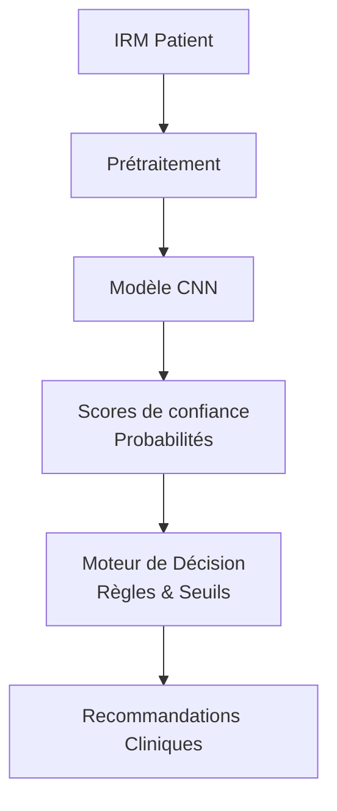

# Contexte Médical

Vous développez un système d'aide à la décision (SAD) pour un service de radiologie. Contrairement à un simple classificateur, votre système ne se contente pas de donner une étiquette, il doit agir comme un partenaire pour le médecin :

- Évaluer le niveau de confiance de chaque prédiction
- Recommander des actions adaptées au degré de certitude
- Prioriser les cas urgents nécessitant une expertise humaine immédiate
- Minimiser les faux négatifs (risque vital critique)

**Note :** Ce projet simule un outil réel d'aide au radiologue et non un remplacement automatique.

## Objectifs Pédagogiques

- Comprendre la différence fondamentale entre classification brute et aide à la décision
- Implémenter un système à seuils de confiance multiples
- Utiliser des métriques orientées "métier" (décision clinique)
- Créer un workflow de triage automatisé

## Données et Définitions

**Dataset :** Brain Tumor MRI Dataset (Kaggle)

**Classes et Implications Cliniques :**

1. Gliome (Tumeur maligne) → URGENT
2. Méningiome (Tumeur bénigne) → Surveillance
3. Tumeur pituitaire → Traitement spécialisé
4. Pas de tumeur → Rassurer le patient

## Architecture du Système

Le flux de données du SAD est le suivant :

**Résultats :**

- Diagnostic avec niveau de certitude
- Actions recommandées
- Niveau de priorité
- Besoin d'expertise humaine
